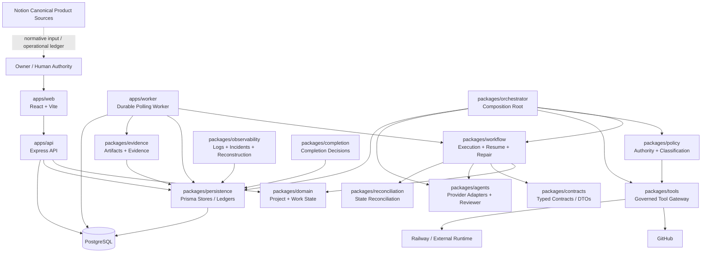
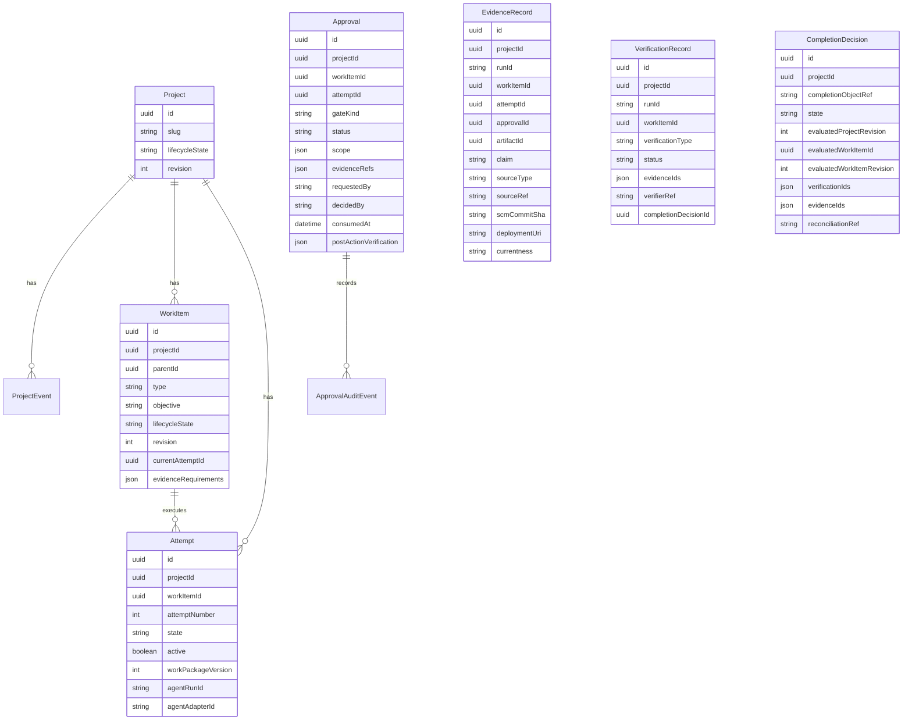
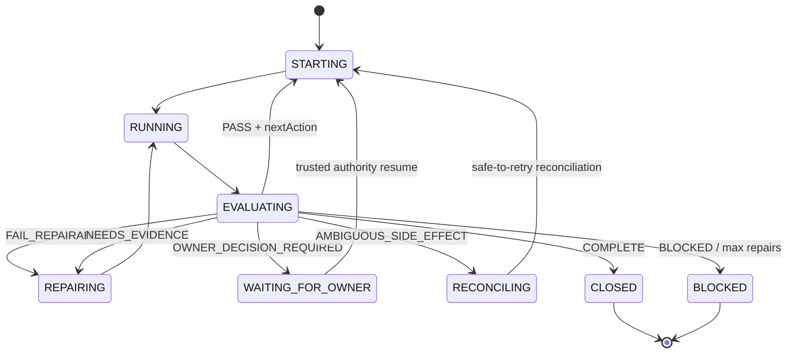

# Constructie Orchestrator V1 — Master Application Map, Handover & Independent Audit Guide

> **Document ID:** `CO-V1-MASTER-HANDOVER-001`  
> **Document type:** Architecture map + implementation handover + independent-audit entrypoint  
> **Snapshot date:** 2026-09-10 (Europe/Bucharest)  
> **Repository:** `obswimclub-web/constructie-orchestrator`  
> **Repository snapshot:** `main@d073e6034c87ce8a0b5386fbc6715a9e574db917`  
> **Snapshot commit message:** `fix(ui): eliminate dead buttons and un-wired controls (#20)`  
> **Primary deployment platform referenced by project evidence:** Railway  
> **Primary datastore:** PostgreSQL / Prisma  
> **Primary implementation language:** TypeScript  
> **Package manager/runtime baseline:** Node 24, pnpm 10  
> **Audience:** Owner, maintainers, independent reviewers, AI auditors (Claude/OpenAI/Gemini/etc.)  
> **Status:** `REFERENCE / HANDOVER SNAPSHOT` — **not a higher authority than the Constitution, locked rules, approved Product Definition, or approved Blueprints**.

---

## 0. Read This First

This document exists to let a new human or AI reviewer understand the Constructie Orchestrator project without depending on chat history.

It has four purposes:

1. explain what the product is supposed to do;
2. map the implementation that actually exists in the repository;
3. identify the authoritative project sources and the places where those sources may have drifted;
4. give an independent AI auditor enough instructions to verify the project from first principles.

This document is intentionally **not** a declaration that V1 is complete.

It is a handover snapshot. It records both implemented capabilities and unresolved or contradictory evidence that must be revalidated.

### 0.1 Golden rule for every future reader

**Repository reality, runtime reality, test evidence and canonical specification must be reconciled. None of them may be silently substituted for another.**

A statement such as “PASS”, “DONE”, “COMPLETE”, “wired”, “production ready”, or “verified” is not sufficient on its own. The auditor must locate the evidence that justifies it and confirm that the evidence applies to the exact revision under audit.

### 0.2 Current snapshot caveat

This document was built against:

```text
repository = obswimclub-web/constructie-orchestrator
branch     = main
commit     = d073e6034c87ce8a0b5386fbc6715a9e574db917
date       = 2026-09-10
```

If `main` is no longer at this SHA, the first task of a future auditor is to compare the new HEAD against this snapshot and classify all differences.

### 0.3 Pre-audit discrepancies already observed

These are **handover observations**, not final audit verdicts:

| ID | Observation at snapshot | Why the auditor must verify it |
|---|---|---|
| HDO-01 | The existing root `README.md` is materially behind the implementation. | Documentation cannot be trusted as a complete current architecture description. |
| HDO-02 | `packages/orchestrator/src/runtime-composition.ts` contains historical text saying production API/worker are stubs, while current API/worker code is substantive. | Inline comments have drifted from implementation. |
| HDO-03 | `apps/worker/src/index.ts` currently wires `MockAgentAdapter('SUCCESS')`, even though real provider adapters exist elsewhere in the repo. | “Real provider adapter exists” is not equivalent to “production worker executes a real provider.” |
| HDO-04 | `apps/web/src/data/api.ts` still returns `[]` for Agents, Incidents, Reviewer Findings and Task Graph, and a static Workspace state. | Screen existence must not be confused with full end-to-end capability. |
| HDO-05 | `docs/p11-v1-traceability-matrix.md` states that required V1 UI views are real-data wired and no required silent mock fallback remains. | This claim must be reconciled with HDO-04 and with current V1 surface requirements. |
| HDO-06 | `scripts/v1-gate.ts` contains `TODO: CMO evidence assertions`. | Final MOC/CMO completion proof may be incomplete in this script. |
| HDO-07 | The GitHub qualification workflow does not invoke `scripts/v1-gate.ts`. | A green `qualify` check is not automatically proof that the separate Final V1 semantic gate ran. |
| HDO-08 | `scripts/v1-gate.ts` rejects `/dist/` imports, while `runtime-composition.ts` currently imports `@co/workflow/dist/run-coordinator.js`. | The Final V1 gate should be executed independently against the exact snapshot. |
| HDO-09 | The newest Execution State Ledger records returned during this handover still referenced `6744a7be...`, while repository `main` is now `d073e603...`. | There is at least a source-of-truth synchronization question. |
| HDO-10 | The latest ledger checkpoint retrieved for DB-rotation review was `NEEDS_EVIDENCE`, not an unambiguous final closure. | Security/credential-rotation closure must be proved, not inferred. |

An independent auditor must confirm, reject or refine every item above.

---

# PART I — PRODUCT, AUTHORITY AND SOURCE OF TRUTH

## 1. What Constructie Orchestrator Is

Constructie Orchestrator is intended to be an autonomous AI coordination platform for software development.

The product North Star is not “an AI that writes code”. It is a governance and execution layer that coordinates:

- product context;
- specifications and blueprints;
- work decomposition;
- AI agents and reviewers;
- tools and infrastructure;
- policy and Owner authority;
- persistent execution state;
- evidence and verification;
- recovery and reconciliation;
- releases and post-deployment checks.

Canonical product flow:

```text
OBJECTIVE
  → ANALYZE
  → PLAN
  → ASSIGN
  → IMPLEMENT
  → INDEPENDENT REVIEW
  → TEST
  → AUDIT
  → REPAIR WHEN NEEDED
  → COMMIT
  → RELEASE / DEPLOY
  → VERIFY
  → PERSIST EVIDENCE
  → CONTINUE / COMPLETE
```

The intended human role is **Owner at reserved authority gates**, not manual operator for routine execution.

The product is explicitly intended to be provider-independent: OpenAI, Anthropic, Google, Antigravity and future providers are execution resources behind contracts/adapters rather than the product itself.

---

## 2. Authority Hierarchy

The project has an explicit authority hierarchy. A new auditor must hydrate this hierarchy before evaluating implementation correctness.

Canonical order:

1. **Constitution**
2. **Locked Rules Registry**
3. **Master Product Definition / FINAL or CLOSED product contracts**
4. **Approved Blueprints**
5. **Architecture and Acceptance Criteria**
6. **Canonical operational plans**
7. **Task instructions**
8. **Runtime instructions**

Where sources conflict, a lower layer must not silently override a higher layer.

### 2.1 Main Notion source map

At snapshot preparation, the active project tree included:

- **Constructie Orchestrator — Master Product Definition**  
  `https://app.notion.com/p/3c1c9d3dd2da815a95c9f80e74af133c`

- **01 — Constitution**  
  `https://app.notion.com/p/3c1c9d3dd2da816fb582dd9e831b3d27`

- **01.1 — Locked Rules Registry**  
  `https://app.notion.com/p/3c1c9d3dd2da81c48a19c9c4b14cd6df`

- **02 — Blueprints**  
  `https://app.notion.com/p/3c1c9d3dd2da81c195afeed78bfc4605`

- **02.1 — Master Product Blueprint**  
  `https://app.notion.com/p/3c1c9d3dd2da81d2a779c4e7c4209fa6`

- **02.2 — System Architecture Blueprint**  
  `https://app.notion.com/p/3c1c9d3dd2da81439248defceeb932fa`

- **02.3 — Agent & Organization Blueprint**  
  `https://app.notion.com/p/3c1c9d3dd2da81b9a2d5d69f405ebb3a`

- **02.7 — V1 Implementation Architecture & Multi-Agent Integration**  
  `https://app.notion.com/p/3c2c9d3dd2da817ab4e6fbc837dd01b4`

- **2.1.5 — V1 Minimum Project Input / START Contract**  
  `https://app.notion.com/p/3c1c9d3dd2da81188113ea5cae160ca8`

- **2.1.6 — V1 Mandatory Output Contract — Detailed Specification**  
  `https://app.notion.com/p/3c1c9d3dd2da812bada5dce181529df7`

- **2.1.6.14 — Final Completion Gate & Completion Decision Lifecycle**  
  `https://app.notion.com/p/3c2c9d3dd2da81219a9bca9c88dd2d2a`

- **2.1.6.15 — MOC-Wide Failure, Recovery & Error Model**  
  `https://app.notion.com/p/3c2c9d3dd2da8107ba0cc1eca594e20f`

- **2.1.6.16 — Final Consolidation & Canonical V1 Mandatory Output Contract**  
  `https://app.notion.com/p/3c2c9d3dd2da81bb9bb1d33ee7de4045`

- **CANON-001 — Canonical V1 Execution Plan to Final Completion — 2026-09-01**  
  `https://app.notion.com/p/3cec9d3dd2da8146af7ce63dbeb79a94`

- **Execution State Ledger database**  
  `https://app.notion.com/p/85750e14d3da44a3b3d8af42c7b9c7d4`

A future auditor should search the live workspace rather than assuming these IDs are eternally current.

---

## 3. Truth Taxonomy

The project deliberately separates different kinds of truth.

### 3.1 Normative truth

What **must** be true according to the Constitution, locked rules, approved Product Definition, MOC and approved Blueprints.

Examples:

- Owner authority boundaries;
- required Primary Use Cases;
- mandatory evidence;
- completion semantics;
- no unsafe autonomous mutations;
- implementation → independent review → repair/retest → re-review;
- recovery must not depend on chat memory.

### 3.2 Observed implementation truth

What the exact repository revision actually implements.

Examples:

- current imports;
- current runtime wiring;
- current API routes;
- current Prisma schema;
- current UI fetch functions;
- current test assertions.

### 3.3 Runtime truth

What is actually deployed and occurring in the current environment.

Examples:

- deployed commit SHA;
- Railway service health;
- environment configuration;
- database migrations applied;
- current authentication behavior;
- actual provider used by worker;
- actual persisted evidence.

### 3.4 Historical truth

A statement that was valid for an older checkpoint but may no longer describe HEAD.

Examples:

- old ledger PASS/FAIL entries;
- old PR acceptance evidence;
- old “current SHA” references;
- stale code comments.

### 3.5 Derived UI truth

A visual or computed representation. It is useful, but may be incomplete or synthetic.

Examples:

- Dashboard KPIs;
- displayed health;
- displayed reviewer state;
- displayed provider availability.

**Rule:** derived UI must never override persisted/runtime/canonical truth.

---

## 4. Governance Execution Loop

The canonical operating loop is:

```text
IMPLEMENT
  → INDEPENDENT REVIEW
    → if FAIL: BOUNDED REPAIR
      → RETEST
        → RE-REVIEW
          → repeat until PASS or legitimate BLOCK
  → FREEZE CANDIDATE
  → OWNER GATE only where reserved
  → governed mutation
  → post-action verification
  → durable evidence
```

Important implications:

- an implementation agent must not self-certify its own work as final;
- the reviewer must be independently instantiated/operated where required;
- repairs must be bounded by findings and authority;
- ambiguous side effects require reconciliation, not blind retry;
- Owner approval is not a general-purpose replacement for orchestrator reasoning;
- a reserved Owner gate must not be bypassed by “convenience” logic.

---

# PART II — V1 PRODUCT REQUIREMENTS

## 5. V1 Primary Use Cases

The Product Definition defines nine Must-have V1 Primary Use Cases.

### UC-01 — Create New Product from Idea

Purpose: transform a raw idea into a sufficiently defined and governed software project.

Canonical result:

```text
START AUTHORIZATION = YES
```

The orchestrator is expected to help construct missing Product Definition, Constitution/Blueprint proposals and technical context rather than requiring the user to arrive with all of them prebuilt.

### UC-02 — Import and Continue Existing Project

Purpose: take over an existing project by discovering real state rather than trusting assumptions.

Core principles:

```text
Read Before Write
Reality Over Documentation
No Blind Modernization
Unknown != Assumption
```

Required distinction:

```text
OBSERVED / INFERRED / PROPOSED / APPROVED
```

Canonical result:

```text
TAKEOVER READINESS = YES
```

### UC-03 — Execute Blueprint End-to-End

Purpose: convert an approved Blueprint into actual execution.

Expected decomposition:

```text
Blueprint
  → Milestone
  → Feature
  → Task
  → Subtask
  → Acceptance Criterion
  → Evidence
```

Canonical result:

```text
BLUEPRINT STATUS = COMPLETE
JUDGE VERDICT = ACCEPTED
```

### UC-04 — Implement New Feature

Purpose: manage an entire change lifecycle from feature request through specification impact, implementation, independent verification, deployment and truth propagation.

Change classes include:

- in-scope implementation;
- Blueprint extension;
- architecture change;
- product scope change;
- constitutional conflict.

Principle:

```text
Code must not silently outrun the specification.
```

### UC-05 — Fix a Bug from User Report

Purpose: transform an incomplete/non-technical bug report into reproducible diagnosis, root cause, fix, regression protection, release and verification.

Principles:

```text
Symptom != Root Cause
Not Reproduced != Invalid Bug
Temporary Mitigation != Permanent Fix
```

### UC-06 — Release to Production

Purpose: promote a validated release candidate safely and reversibly.

Principle:

```text
Deployment successful != Release successful
```

Application rollback and data rollback are separate concerns.

### UC-07 — Recover from Failure

Purpose: recover from interrupted/failed work while preserving durable state, prior evidence and external-state knowledge.

Critical principle:

```text
Conversation memory is not execution state.
```

Valid outcomes include safe resume, replan, rollback, or legitimate human decision/block.

### UC-08 — Audit Project Health

Purpose: compare specification, code, tests, deployment, runtime and evidence and identify drift.

Named drift classes include:

- Specification Drift;
- Architecture Drift;
- Environment Drift;
- Documentation Drift;
- Evidence Drift;
- Permission Drift.

A numeric score may not hide a critical blocker.

### UC-09 — Maintain Product Continuously

Purpose: run a continuing maintenance loop after launch.

Core loop:

```text
OBSERVE
  → COLLECT SIGNALS
  → CLASSIFY
  → PRIORITIZE
  → CREATE WORK
  → IMPLEMENT / REPAIR
  → REVIEW
  → TEST
  → AUDIT
  → DEPLOY
  → VERIFY
  → UPDATE HEALTH / MEMORY
  → CONTINUE
```

---

## 6. Mandatory Output / Completion Model

The V1 Product Definition contains:

- UMO-01 through UMO-07;
- CMO-01 through CMO-14;
- Applicability Decision Algorithm;
- Manifest;
- Fulfillment;
- Reconciliation;
- Completion Decision;
- failure/recovery semantics;
- final system acceptance.

The source of truth for exact definitions is the Notion MOC, not this summary.

The repository has a `packages/completion` package and persistent `CompletionDecision` records, but the auditor must independently verify that:

1. every mandatory output has executable semantics;
2. applicability is resolved correctly;
3. evidence is current and scoped correctly;
4. every completion claim is backed by verification;
5. the Final Completion Gate covers **both Primary Use Cases and CMO obligations**;
6. no success condition is satisfied solely by fixture self-declaration.

---

# PART III — SYSTEM ARCHITECTURE

## 7. High-Level Architecture



### 7.1 Important architecture distinction

There are currently multiple execution compositions in the codebase.

The **generic/internal composition root** in `packages/orchestrator/src/runtime-composition.ts` wires governed tools, policy, Codex, OpenAI reviewer and an Antigravity bridge.

The **worker bootstrap actually used by `apps/worker/src/index.ts`** currently creates:

```text
WorkStore
→ MinimalWorkflowEngine
→ MockAgentAdapter('SUCCESS')
→ PrismaEvidenceStore
→ WorkerHost
```

An auditor must not assume those two compositions are the same production path.

---

## 8. Monorepo Topology

Approximate root structure at the snapshot:

```text
constructie-orchestrator/
├── .github/
│   └── workflows/
│       ├── ci.yml
│       ├── qual-001-lockfile.yml
│       └── qualification.yml
├── apps/
│   ├── api/
│   ├── web/
│   └── worker/
├── docs/
│   ├── ARCHITECTURE.md
│   ├── BOOT-*.md
│   ├── disaster-recovery.md
│   ├── implementation/
│   └── p11-v1-traceability-matrix.md
├── infra/
├── packages/
│   ├── agents/
│   ├── completion/
│   ├── contracts/
│   ├── domain/
│   ├── evidence/
│   ├── observability/
│   ├── orchestrator/
│   ├── persistence/
│   ├── policy/
│   ├── reconciliation/
│   ├── recovery/
│   ├── testkit/
│   ├── tools/
│   └── workflow/
├── scripts/
│   ├── apply-sql-migrations.mjs
│   ├── check-architecture.mjs
│   └── v1-gate.ts
├── tests/
│   ├── agents/
│   ├── api/
│   ├── domain/
│   ├── e2e/
│   ├── evidence/
│   ├── integration/
│   ├── observability/
│   ├── orchestrator/
│   ├── persistence/
│   ├── policy/
│   ├── reconciliation/
│   ├── restart/
│   ├── scripts/
│   ├── tools/
│   └── workflow/
├── docker-compose.yml
├── evidence-report.md
├── implementation_plan.md
├── package.json
├── pnpm-lock.yaml
├── pnpm-workspace.yaml
├── tsconfig.base.json
├── tsconfig.json
└── vitest.config.ts
```

---

# PART IV — APPLICATIONS

## 9. `apps/api`

### 9.1 Responsibility

`apps/api` is the HTTP control/data plane for the browser and service actors.

Implementation characteristics at snapshot:

- Express;
- Prisma with PostgreSQL adapter;
- cookie parsing with signed session cookie;
- exact-origin CORS configuration;
- CSRF origin checks for mutating methods;
- Owner bootstrap authentication;
- service-to-service bearer authentication;
- project-bound authorization;
- project/work item/attempt/evidence/approval/audit-log surfaces.

Default local port:

```text
3001
```

Health route:

```text
GET /api/health
```

### 9.2 Authentication modes

#### Browser Owner session

Login:

```text
POST /api/auth/login
```

Input is a bootstrap key compared to `OWNER_BOOTSTRAP_KEY` using constant-time comparison.

The API sets a signed, HTTP-only `co_session` cookie.

Relevant environment inputs include:

```text
OWNER_BOOTSTRAP_KEY
SESSION_SECRET
WEB_ORIGIN
NODE_ENV
```

#### Service actor authentication

The API accepts a bearer token shaped as:

```text
<projectId>.<hmac-signature>
```

The HMAC uses `API_SERVICE_TOKEN`.

Observed service auth context:

```text
actorType = SERVICE
role      = AGENT
projectId = token-bound project
```

A security audit should examine replay/rotation/expiry properties of this model rather than assuming HMAC alone provides all required controls.

### 9.3 Observed route surface

Public/auth bootstrap routes before the main authorization middleware:

```text
GET  /api/health
GET  /api/auth/session
POST /api/auth/login
POST /api/auth/select-project
POST /api/auth/logout
```

Project/work routes:

```text
POST /api/projects
GET  /api/projects

POST /api/work-items
POST /api/work-items/:id/start
GET  /api/work-items

GET  /api/attempts
GET  /api/evidence
```

Approval routes:

```text
GET  /api/approvals
GET  /api/approvals/:id
POST /api/approvals
POST /api/approvals/:id/decide
POST /api/approvals/:id/consume
POST /api/approvals/:id/verify
```

Observability/audit route:

```text
GET /api/audit-logs
```

This route list should be regenerated from HEAD during audit.

### 9.4 API audit questions

The auditor should verify:

- project-bound isolation on every route;
- owner-only boundaries for reserved actions;
- service-role permissions;
- CORS behavior for missing/mismatched origins;
- CSRF behavior for cookie sessions;
- cookie signing/expiry/configuration;
- session fixation or project-switching risks;
- leakage of raw errors/secrets;
- approval single-use semantics;
- transactional behavior where approval consumption is supposed to be atomic;
- pagination/limits on telemetry endpoints;
- whether CompletionDecision/Incident/Agent/Reviewer data needs API exposure under V1;
- whether the API is the true production control plane or only a partial UI backend.

---

## 10. `apps/web`

### 10.1 Responsibility

`apps/web` is a React/Vite Owner console.

The router exposes:

```text
/dashboard
/projects
/workspace
/task-graph
/agents
/runs
/reviewer-findings
/approvals
/evidence
/incidents
/logs
/settings
```

The app checks `/api/auth/session`; if unauthenticated it shows an Owner bootstrap login overlay.

### 10.2 Current real-data integration map

Observed in `apps/web/src/data/api.ts`:

| Frontend function / surface | Current observed source |
|---|---|
| `checkSession` | real API |
| `loginWithBootstrap` | real API |
| `logoutOwner` | real API |
| `fetchProjects` | real API |
| `fetchWorkItems` | real API |
| `fetchAttempts` | real API |
| `fetchEvidence` | real API |
| `fetchApprovals` | real API |
| `fetchApproval` | real API |
| `createApproval` | real API |
| `decideApproval` | real API |
| `consumeApproval` | real API |
| `fetchLogs` | real `/api/audit-logs` |
| `createProject` | real API mutation |
| `createWorkItem` | real API mutation |
| `fetchAgents` | returns `[]` |
| `fetchIncidents` | returns `[]` |
| `fetchFindings` | returns `[]` |
| `fetchTaskGraph` | returns `[]` |
| `fetchWorkspaceState` | static placeholder state |
| dashboard agent/incident counts | partly static/derived |
| run details | derived from work items, not full run model |

### 10.3 Implication

The UI should be audited per capability, not per route existence.

A page is not “fully wired” merely because:

- the route renders;
- a component exists;
- no mock fixture file is called;
- a table can render an empty array.

### 10.4 Recent UI change at snapshot HEAD

The snapshot commit `d073e603...` was:

```text
fix(ui): eliminate dead buttons and un-wired controls (#20)
```

Observed intent included disabling not-yet-supported actions and wiring the Approval evidence pack navigation to `/evidence`.

The auditor should inspect PR #20 and verify that disabled controls accurately communicate capability state.

---

## 11. `apps/worker`

### 11.1 Responsibility

`WorkerHost` is a genuine polling execution host.

Observed behavior:

1. connects to PostgreSQL;
2. queries `READY` / `QUEUED` work items with no active attempt;
3. processes up to a batch size of five;
4. builds a typed `WorkPackage`;
5. invokes `MinimalWorkflowEngine`;
6. persists artifacts and evidence;
7. handles attempt conflicts;
8. supports graceful SIGTERM/SIGINT shutdown.

Default polling interval:

```text
5000 ms
```

### 11.2 Duplicate-execution invariant

The worker code explicitly relies on `WorkStore.startAttempt` to reject concurrent semantic execution via errors such as:

```text
ActiveAttemptExistsError
WorkItemRevisionConflictError
```

The intended invariant is:

```text
ONE_ACTIVE_SEMANTIC_EXECUTION_PER_WORK_PACKAGE = true
```

This must be tested against a real shared PostgreSQL database and concurrent workers, not only in-memory fixtures.

### 11.3 Current provider wiring warning

At this snapshot, `apps/worker/src/index.ts` imports and instantiates:

```ts
new MockAgentAdapter('SUCCESS')
```

This is one of the most important audit facts in this handover.

The repo contains real adapters, but the current worker bootstrap does not prove they are the provider behind production worker execution.

The auditor must determine:

- whether a different production entrypoint overrides this;
- whether deployment configuration injects a different adapter;
- whether production is intentionally still in mock execution mode;
- whether canonical V1 requires a live-provider execution path at this gate;
- whether historical provider qualification evidence applies to current production runtime.

---

# PART V — CORE PACKAGES

## 12. `packages/contracts`

Purpose: provider-neutral and runtime-neutral typed contracts.

Key areas:

```text
agent/
api/dtos.ts
reviewer-contracts.ts
reviewer.ts
tool/
workflow/agent-bridge.ts
```

Expected responsibility:

- define boundary objects;
- validate agent/work package shapes;
- keep provider-specific SDK types from leaking into core domain logic;
- provide DTOs between API and UI.

Audit focus:

- schema/version compatibility;
- Zod/runtime validation at trust boundaries;
- optional fields that may accidentally weaken mandatory evidence;
- whether contract revisions are persisted and traceable;
- whether provider adapters conform without semantic loss.

---

## 13. `packages/domain`

Purpose: pure business state and transitions.

Key areas:

```text
project/
work-item.ts
```

Architecture rule enforced by `scripts/check-architecture.mjs`:

The domain package must not import infrastructure/provider dependencies such as:

```text
Prisma
Redis
OpenAI
Anthropic
Google
GitHub / Octokit
```

The architecture script currently checks this domain isolation only. It should not be interpreted as a complete verification of every package-dependency invariant.

Audit focus:

- state-machine legality;
- revision monotonicity;
- invalid transitions;
- concurrency conflicts;
- identity and project scoping;
- whether evidence requirements are domain-owned or merely persisted JSON.

---

## 14. `packages/persistence`

Purpose: durable system state.

Main areas:

```text
prisma/schema.prisma
src/evidence/
src/observability/
src/project/
src/work/
```

Historical migration set observed:

```text
0001 canonical project/event
0002 work item / attempt
0003 evidence verification
0004 completion decisions
0005 attempt ↔ agent run binding
0006 real approval model
0007 P9 evidence lineage
0008 P9 S3 observability
0009 R60 evidence requirements
```

### 14.1 Main persisted entities

Current Prisma schema contains:

- `Project`
- `ProjectEvent`
- `OutboxEvent`
- `WorkItem`
- `Attempt`
- `ArtifactRecord`
- `EvidenceRecord`
- `VerificationRecord`
- `CompletionDecision`
- `Approval`
- `ApprovalAuditEvent`
- `ExecutionLogRecord`
- `IncidentEventRecord`

### 14.2 Conceptual data model



### 14.3 Persistence audit focus

Verify:

- foreign-key integrity;
- event append uniqueness;
- optimistic-concurrency/revision behavior;
- current attempt ownership;
- attempt deactivation on all terminal paths;
- atomic approval decisions and single-use consumption;
- evidence immutability/currentness semantics;
- digest/hash verification;
- migration idempotency;
- migration ordering and production migration state;
- backup/restore evidence;
- least-privilege DB role;
- credential rotation closure;
- persistence of interrupted in-flight execution.

---

## 15. `packages/workflow`

Purpose: work execution, lifecycle coordination, repair, waiting, reconciliation and resume.

Key files include:

```text
minimal-workflow-engine.ts
run-coordinator.ts
blueprint-runner
multi-agent-router
resume-coordinator
```

### 15.1 `RunCoordinator`

Observed run states:

```text
STARTING
RUNNING
EVALUATING
REPAIRING
WAITING_FOR_OWNER
RECONCILING
CLOSED
BLOCKED
```

Observed reviewer decisions:

```text
PASS
FAIL_REPAIRABLE
OWNER_DECISION_REQUIRED
AMBIGUOUS_SIDE_EFFECT
BLOCKED
COMPLETE
NEEDS_EVIDENCE
```

Conceptual lifecycle:



### 15.2 Important implementation semantics

- repair attempts are bounded;
- PASS requires a continuation `nextAction`;
- COMPLETE closes the run;
- ambiguous transport/side-effect states do not automatically retry;
- Owner resume requires a branded/sealed authority object;
- reconciliation outcomes are branded/sealed;
- events are persisted to an event ledger;
- state reconstruction replays prior events.

### 15.3 Workflow audit focus

Verify that:

- all event transitions are replay-safe;
- recovery reconstructs enough information to continue;
- no duplicate external mutation is possible after timeout;
- attempt IDs/work package IDs are regenerated only when semantically correct;
- repair feedback cannot broaden authority;
- max-repair behavior is consistent with canonical failure model;
- PASS vs COMPLETE semantics match MOC;
- `NEEDS_EVIDENCE` cannot become completion without fresh evidence;
- Owner authority is scoped to the exact pending action/gate;
- all runtime paths are reachable in the actual deployed composition.

---

## 16. `packages/orchestrator`

Purpose: canonical composition and structured reviewer wiring.

Observed `createRuntimeComposition` capabilities:

- `TrustedOwnerAuthorityIssuer`;
- `TrustedReconciliationIssuer`;
- `OwnerEventProcessor`;
- read-only policy view;
- Prisma action audit ledger;
- action-classifying policy engine;
- governed tool gateway;
- filesystem/git/qualification adapters;
- output redactor;
- Codex adapter;
- OpenAI reviewer;
- Antigravity Python bridge;
- `RunCoordinator`.

### 16.1 Capability-isolation intent

The composition comments specify:

- agents receive the governed gateway, not raw tool adapters;
- policy sees a read-only context, not control-plane mutators;
- trusted authority issuers remain at composition root;
- production gateway requires policy enforcement.

This is a strong architectural intent and must be verified against every actual construction path.

### 16.2 Known snapshot drift in this file

Two specific audit targets:

1. historical comment says `PRODUCTION_RUNTIME_EXISTS=false (apps/api and apps/worker are stubs)` although current app code is substantive;
2. it imports `TrustedReconciliationIssuer` through:

```text
@co/workflow/dist/run-coordinator.js
```

while the separate `v1-gate.ts` explicitly rejects `/dist/` imports.

---

## 17. `packages/agents`

Purpose: provider abstraction and independent reviewer adapters.

Observed provider-related implementation includes:

- Codex adapter;
- Anthropic adapter;
- Gemini adapter;
- Antigravity adapter;
- Antigravity Python bridge;
- per-run IPC support;
- mock agent adapter;
- OpenAI reviewer adapter;
- provider output parser.

Important distinction:

```text
ADAPTER IMPLEMENTED
!=
ADAPTER QUALIFIED
!=
ADAPTER SELECTED BY RUNTIME
!=
ADAPTER USED IN PRODUCTION
```

Audit each level separately.

### 17.1 Provider audit questions

- Is the adapter contract provider-neutral?
- Are outputs schema-validated?
- Are malformed or partial provider results fail-closed?
- Are tool calls routed only through GovernedToolGateway?
- Are secrets represented as refs rather than injected into model context?
- Are provider timeouts/cancellations observable?
- Can one provider be replaced without changing workflow semantics?
- Is reviewer independence real or only a second call through the same execution path?
- Does production worker currently use a real provider?
- What exact provider/model produced historical evidence claims?

---

## 18. `packages/policy`

Purpose: authority, action classification and enforcement context.

Observed components include:

- action classifier;
- action-classifying policy engine;
- owner authority event;
- trusted owner authority issuer;
- owner event processor;
- read-only execution context;
- action audit ledger types.

Expected rule:

```text
If an action is necessary, in scope, authorized, sufficiently safe and verifiable,
the Orchestrator should execute it autonomously.
Reserved or prohibited actions must not be escalated away from policy.
```

This means the system must avoid both:

- **over-autonomy** — bypassing Owner/governance limits;
- **under-autonomy** — asking the Owner to perform routine allowed operations.

### 18.1 Policy audit focus

- action classification completeness;
- default-deny behavior for unknown/high-risk actions;
- environment boundaries;
- commit vs push vs deploy as distinct authority gates;
- grant issue/consume/revoke lifecycle;
- non-forgeability of authority events;
- task/project binding;
- cross-attempt reuse;
- privilege escalation through repair prompts;
- external-host restrictions;
- secret handling and redaction.

---

## 19. `packages/tools`

Purpose: all mutation-capable operations behind governance.

Observed areas:

- `GovernedToolGateway`;
- `StructuredGitAdapter`;
- `QualificationAdapter`;
- `SandboxFilesystemAdapter`;
- static policy utilities for tests;
- output redaction.

Expected invariant:

```text
AGENT
  → governed tool contract
  → action classification
  → authority decision
  → concrete adapter
  → audit event
  → post-action evidence
```

The auditor should search for direct use of:

- `child_process`;
- raw `git`;
- raw filesystem mutation;
- provider SDK tools;
- deployment APIs;
- GitHub SDKs;
- shell execution;

outside approved adapters/composition.

---

## 20. `packages/evidence`

Purpose: persist and verify claims/artifacts.

Evidence must be tied to real identities such as:

- project;
- work item;
- attempt;
- run;
- agent;
- artifact;
- approval;
- SCM commit;
- deployment;
- observed time.

Core principle:

```text
Agent says "done" != verified completion.
```

Audit:

- lineage completeness;
- evidence freshness;
- evidence identity stability;
- deterministic or content-based artifact identity;
- verification references;
- stale evidence invalidation after revision changes;
- evidence requirements per work item;
- semantic proof vs test fixture self-assertion.

---

## 21. `packages/observability`

Purpose: execution logs, incidents, redaction and reconstruction.

Observed implementation includes:

- logger;
- incident model/store;
- reconstruction;
- redaction;
- hash-chained persistence fields.

The Prisma schema includes:

```text
ExecutionLogRecord.previousHash
ExecutionLogRecord.hash

IncidentEventRecord.previousHash
IncidentEventRecord.hash
```

Audit:

- sequence monotonicity;
- tamper-evidence verification;
- secret redaction before persistence/output;
- trace IDs across API/worker/agent/tool;
- incident state transitions;
- recovery evidence for incident closure;
- ability to reconstruct a run without chat history.

---

## 22. `packages/reconciliation` and `packages/recovery`

Purpose: reconcile ambiguous internal state with external reality and support safe continuation.

Critical rule:

```text
UNKNOWN EXTERNAL SIDE EFFECT
!=
SAFE TO RETRY
```

The auditor should verify:

- external state checks occur before retry;
- safe-to-retry decisions are trusted/branded;
- correlation/causation identities are preserved;
- interrupted deployment/git/tool operations cannot duplicate semantic side effects;
- unresolved ambiguity produces a legitimate block rather than invented success.

---

## 23. `packages/completion`

Purpose: represent and evaluate final completion.

Persistent `CompletionDecision` includes:

- project;
- completion object reference;
- state;
- evaluated project revision;
- evaluated work item + revision;
- verification IDs;
- evidence IDs;
- reconciliation reference;
- rationale codes;
- decision timestamp.

Audit:

- decisions are immutable/historical;
- old completion decisions do not survive incompatible revisions;
- all mandatory output applicability is resolved;
- required verification sets are complete;
- completion is impossible with stale/missing evidence;
- final product completion is not merely work-item completion.

---

# PART VI — OWNER AUTHORITY AND APPROVALS

## 24. Approval Model

The current database model persists:

```text
gateKind
status
scope
evidenceRefs
requestedBy
requestedAt
expiresAt
decidedBy
decidedAt
rationale
consumedAt
postActionVerification
```

and a separate `ApprovalAuditEvent`.

The API implements:

1. create approval;
2. list/get approval;
3. approve/reject;
4. atomically consume an approved approval;
5. attach post-action verification.

### 24.1 Expected approval invariants

- approval is project-bound;
- approval is gate/action scoped;
- approval may expire;
- approval is single-use;
- approval decision and consumption are auditable;
- consuming approval does not itself prove the action succeeded;
- post-action verification is separate;
- an approval for commit must not imply approval for push/deploy unless explicitly modeled;
- a rejected/expired/consumed approval cannot be replayed.

---

# PART VII — CI, TESTING AND QUALIFICATION

## 25. Root package scripts

Observed root scripts:

```text
pnpm build
pnpm typecheck
pnpm test
pnpm test:unit
pnpm test:integration
pnpm test:e2e
pnpm lint
pnpm format:check
pnpm arch:check
pnpm ci
pnpm db:migrate:sql
pnpm test:restart:postgres
pnpm qualification
```

Runtime constraints:

```text
node >=24 <25
pnpm >=10
packageManager pnpm@10.15.0
```

### 25.1 Root `qualification`

Current command:

```text
pnpm lint
&& pnpm typecheck
&& pnpm build
&& pnpm test
&& pnpm test:restart:postgres
&& pnpm arch:check
```

---

## 26. GitHub qualification workflow

`.github/workflows/qualification.yml`:

- checks out exact revision;
- Node 24;
- pnpm 10;
- PostgreSQL 17 service;
- Redis 8 service;
- frozen lockfile install;
- Prisma validation/generation;
- canonical SQL migrations;
- lint;
- typecheck;
- build;
- all tests;
- PostgreSQL restart/resume proof;
- architecture check.

This is a strong baseline qualification suite.

It is **not**, at the snapshot, the same thing as executing `scripts/v1-gate.ts`.

---

## 27. Final V1 semantic gate

`scripts/v1-gate.ts` performs additional semantic-evidence checks for UC-01 through UC-09.

It expects conditions including:

```text
UC-01 START AUTHORIZATION = YES
UC-02 TAKEOVER READINESS = YES
UC-03 BLUEPRINT STATUS = COMPLETE
      JUDGE VERDICT = ACCEPTED
...
UC-06 RELEASE STATUS = COMPLETE
      PRODUCTION VERSION = VERIFIED
      POST-DEPLOY STATUS = HEALTHY
...
UC-09 PROJECT OPERATIONAL
      HEALTH STATUS = ACCEPTABLE
      CRITICAL UNRESOLVED ISSUES = 0
      MAINTENANCE LOOP = ACTIVE
      SOURCE OF TRUTH = CURRENT
```

However, at snapshot it contains:

```text
// TODO: CMO evidence assertions
```

and is not invoked by the qualification workflow shown above.

It also rejects source imports matching `/dist/`.

Therefore the independent auditor must run and inspect this gate separately and must not infer its outcome from the standard `qualify` job.

---

## 28. Test landscape

The repository contains unit, integration and E2E coverage across:

### Agent/provider

- Codex adapter;
- Mock adapter;
- Antigravity bridge / IPC;
- provider output parser;
- provider qualification.

### API

- general API;
- approvals;
- cross-site auth;
- entry/auth behavior.

### Domain

- WorkItem state machine.

### E2E

Observed use-case and governance-oriented tests include:

```text
bootstrap
cmo-integrity
external-host-policy
first-mock-outcome
multi-agent-governance
no-messenger-e2e
orchestrator-lifecycle-e2e
p12-r57-repair
p12-r60-closure
policy-enforcement
semantic-evidence-writer
uc-02-takeover
uc-03-execute-blueprint
uc-04-feature-lifecycle
uc-05-bug-lifecycle
uc-06-release-lifecycle
uc-07-recovery-resume
uc-08-project-health
uc-09-continuous-maintenance
```

### Integration

- durable observability;
- evidence persistence;
- project persistence;
- restart/resume coordinator;
- restart/resume PostgreSQL;
- work-item dispatch;
- worker evidence identity.

### Security/policy/tools

- action classifier;
- owner event processor;
- policy engine;
- secret guards;
- workflow governance;
- governed gateway;
- output redactor;
- structured Git adapter;
- qualification adapter.

### Audit warning

A test file name is not proof of semantic sufficiency.

The auditor should inspect:

- fixture realism;
- mocks;
- whether test success strings are generated by the system or hard-coded by the fixture;
- whether production paths are exercised;
- whether independent reviewer is genuinely independent;
- whether DB tests use the same concurrency/transaction behavior as production;
- whether deployment tests validate a live target or a stubbed adapter.

---

# PART VIII — TRACEABILITY

## 29. Existing P11 traceability matrix

`docs/p11-v1-traceability-matrix.md` maps canonical requirements to:

- source documents;
- modules;
- tests;
- runtime surfaces;
- historical evidence refs;
- PASS status.

It covers areas including:

- project creation/import;
- hydration;
- task graph;
- workflow;
- attempts;
- provider routing;
- reviewer;
- repair;
- completion;
- approvals;
- commit/push/deployment gates;
- persistence;
- restart/resume;
- duplicate execution prevention;
- evidence;
- logs/incidents;
- security;
- API/UI;
- worker;
- production readiness;
- backup/recovery/rollback.

This matrix is valuable as a **historical traceability index**.

It must not be accepted without revalidation because the current repo can move after its claims were recorded.

### 29.1 Specific reconciliation target

The P11 matrix says:

```text
UI REQUIRED V1 SURFACES TRACEABILITY: PASS
Required V1 views are real-data wired...
```

Current `apps/web/src/data/api.ts` still contains empty/static functions for several screens.

The audit must determine one of:

1. those screens are not required V1 surfaces and the P11 statement is still semantically correct;
2. the implementation regressed after P11;
3. P11 overclaimed wiring;
4. another code path not yet identified supplies those data;
5. the required definition changed through approved change control.

No answer should be assumed before evidence.

---

# PART IX — SECURITY AND TRUST BOUNDARIES

## 30. Security model overview

The project contains several intended trust boundaries:

```text
Owner
  ↕ authenticated browser
API
  ↕ project-bound auth
Persistent state

Agent/provider
  ↕ typed contracts
Governed Tool Gateway
  ↕ policy classification + authority
Tool adapters
  ↕ external systems

Reviewer
  ↕ separate review contract
Evidence / Verification
  ↕ Completion
```

### 30.1 Security-critical areas

Audit at least:

- Owner bootstrap key handling;
- session cookie signing;
- cross-site cookie/CORS/CSRF behavior;
- service bearer HMAC;
- project isolation;
- secret refs vs raw secrets;
- output redaction;
- logs and exception redaction;
- provider prompt leakage;
- Git mutation authority;
- deployment authority;
- DB credentials and rotation;
- old credential revocation;
- least privilege;
- external host/tool restrictions;
- approval replay;
- event forgery;
- reconciliation forgery;
- stale authority after restart.

### 30.2 Credential incident history requiring reconciliation

The Execution State Ledger entries retrieved while preparing this handover included historical/current checkpoints around:

- Railway control-plane token containment;
- DB credential rotation;
- re-exposure concerns in logs;
- a later independent DB-rotation review marked `NEEDS_EVIDENCE`.

The latest such row retrieved referenced commit:

```text
6744a7beab537496f7682ef4b22b13fbdc885f28
```

and did **not** establish all of:

- API-to-DB connectivity proof;
- effective privileges of the new DB role;
- revocation of the old credential;
- exact deployed SHAs.

Because repository HEAD is later, the auditor must search for newer closure evidence before treating this as an unresolved current incident.

Do not print, retrieve, hash or reuse raw secret material during that audit.

---

# PART X — INFRASTRUCTURE AND DEPLOYMENT

## 31. Known infrastructure model

Repository/runtime evidence points to:

- GitHub source control;
- GitHub Actions qualification;
- Railway deployment/runtime;
- PostgreSQL persistence;
- Redis available in qualification environment;
- Node 24/pnpm 10;
- Prisma migrations;
- browser web app + API + worker services.

### 31.1 What must be re-discovered from live infrastructure

The handover document deliberately does not pretend to know live production values.

The auditor should obtain read-only/current metadata for:

- web deployment URL + SHA;
- API deployment URL + SHA;
- worker deployment SHA;
- environment names;
- database instance and migration level;
- Redis use, if any;
- current provider configuration;
- service health;
- deployment history;
- rollback target;
- branch protection / required checks.

Secrets should be referenced by variable name only.

---

# PART XI — HISTORICAL IMPLEMENTATION PLAN

## 32. BOOT phase

The repository includes BOOT documentation for foundational monorepo and architecture work.

Historical BOOT artifacts should be treated as implementation history, not current-state truth.

Existing root README material is known to lag behind the current code.

---

## 33. CANON-001 P0 → P12

The canonical plan defined the implementation sequence:

| Phase | Purpose |
|---|---|
| P0 | State reconciliation |
| P1 | Formal reviewer / issue closure |
| P2 | Final engine / Issue #3 reconciliation |
| P3 | Read-only telemetry API |
| P4 | UI real-data integration |
| P5 | Production worker execution host |
| P6 | Real Owner approval flow |
| P7 | Multi-provider operational qualification |
| P8 | Security / governance hardening |
| P9 | Evidence, logging, observability |
| P10 | Production readiness and recovery |
| P11 | Documentation consolidation and traceability |
| P12 | V1 final completion gate |

Do not infer that “phase exists” means “phase is currently PASS”.

Use the live ledger + exact repository + exact runtime evidence.

---

# PART XII — CURRENT OBSERVED SNAPSHOT

## 34. Repository identity

At handover preparation:

```text
repo:   obswimclub-web/constructie-orchestrator
main:   d073e6034c87ce8a0b5386fbc6715a9e574db917
date:   2026-09-10
```

HEAD message:

```text
fix(ui): eliminate dead buttons and un-wired controls (#20)
```

Open project issues observed included:

```text
#3  V1 Blueprint Autopilot — execute canonical Notion plan to full application completion
#19 P12 Night Autopilot Bridge — ChatGPT ↔ Antigravity
```

Issue bodies are historical operational artifacts; their “current SHA” statements must not override live HEAD.

---

## 35. Execution State Ledger drift checkpoint

The latest ledger entries returned during handover research were still centered around P12-R76 and commit `6744a7be...`.

The repository is now at `d073e603...`.

This creates an audit question:

```text
Is the Notion operational ledger behind the repository,
or are newer canonical entries stored elsewhere/not returned by the query?
```

Do not resolve this by assumption.

A complete audit should produce a reconciliation table:

| Surface | Identity / latest state | Evidence | Verdict |
|---|---|---|---|
| GitHub main | exact SHA | GitHub | |
| GitHub open PRs | exact heads | GitHub | |
| Notion canonical plan | version/status | Notion | |
| Notion ledger | newest applicable row | Notion | |
| Web deployment | SHA | Railway | |
| API deployment | SHA | Railway | |
| Worker deployment | SHA | Railway | |
| DB migrations | latest applied | DB/Railway | |
| Provider runtime | actual adapter/model | runtime config/evidence | |

---

# PART XIII — KNOWN AUDIT HOTSPOTS

## 36. Priority audit queue

### A. Production provider wiring — HIGH

Question:

```text
Why does the production worker bootstrap instantiate MockAgentAdapter('SUCCESS')?
```

Need to determine whether this is:

- intentional V1 mode;
- stale entrypoint;
- test-only behavior accidentally used in runtime;
- overridden by deployment;
- a real V1 completion gap.

### B. Final V1 Gate vs qualification — HIGH

Verify:

- whether `scripts/v1-gate.ts` currently runs;
- whether it currently passes;
- why it is outside `qualification.yml`;
- how CMO-01..14 are proven given the TODO;
- whether `/dist/` import causes gate failure.

### C. UI traceability claim — HIGH/MEDIUM

Reconcile:

```text
P11 "required V1 views real-data wired"
vs
current empty/static fetch functions
```

### D. Ledger ↔ Git ↔ deployment identity — HIGH

Reconcile `6744...` ledger checkpoints against `d073...` repo HEAD and actual deployed SHAs.

### E. Credential rotation closure — HIGH

Find proof, without exposing secrets, for:

- new role operational;
- least privilege;
- old credential revoked;
- services reconnected with new secret;
- deployment identity;
- no raw secret retained in logs/artifacts.

### F. Independent review reality — HIGH

Prove that review is not merely:

- same fixture;
- same mocked output;
- same provider self-check;
- deterministic test shortcut.

### G. Restart/resume semantics — HIGH

Prove in-flight interruption and safe continuation without duplicate semantic execution.

### H. Architecture-check coverage — MEDIUM

`arch:check` currently guards forbidden dependencies in `packages/domain`. Determine what other architectural invariants require static enforcement.

### I. Stale comments/docs — MEDIUM

Update only after audit determines real truth. Do not “clean up” evidence before understanding why it drifted.

---

# PART XIV — LOCAL BUILD AND AUDIT COMMANDS

## 37. Baseline environment

Expected:

```text
Node 24
pnpm 10+
PostgreSQL
```

Install:

```bash
pnpm install --frozen-lockfile
```

Validate/generate Prisma:

```bash
pnpm --filter @co/persistence prisma:validate
pnpm --filter @co/persistence prisma:generate
```

Apply SQL migrations to a dedicated audit database only:

```bash
pnpm db:migrate:sql
```

Quality:

```bash
pnpm lint
pnpm typecheck
pnpm build
pnpm test
pnpm test:restart:postgres
pnpm arch:check
```

Combined:

```bash
pnpm qualification
```

Separate semantic gate:

```bash
# scripts/v1-gate.ts is not exposed as a root npm script at this snapshot.
# Execute only in an isolated audit workspace after inspecting the script and prerequisites.
```

### 37.1 Audit safety

Before running anything:

```bash
git status --short
git rev-parse HEAD
git rev-parse origin/main
```

Use a clean clone or isolated worktree.

Do not run production-mutating commands merely to “see what happens”.

---

# PART XV — AI HANDOVER: INSTRUCTIONS FOR CLAUDE OR ANY INDEPENDENT AUDITOR

## 38. Mission

You are receiving the Constructie Orchestrator project for an **independent forensic implementation audit**.

Your job is not to continue the previous assistant's assumptions.

Your job is to independently determine:

1. what the canonical V1 requires;
2. what the exact repository revision implements;
3. what tests prove;
4. what the deployed runtime actually runs;
5. what evidence is current;
6. where any drift/contradiction exists;
7. whether V1 completion can be legitimately declared.

---

## 39. Non-negotiable audit rules

### Rule 1 — Read before write

The first audit pass is read-only.

Do not edit code, config, Notion, GitHub, Railway or the database during discovery.

### Rule 2 — No secret extraction

Never print or copy raw:

- DB URLs;
- API keys;
- Railway tokens;
- provider keys;
- session secrets;
- owner bootstrap keys.

Use variable names and redacted fingerprints only when strictly necessary and safe.

### Rule 3 — Exact identity

Every claim must identify the revision/surface it applies to.

Examples:

```text
repo SHA
PR SHA
deployment SHA
migration version
work item ID
attempt ID
run ID
evidence ID
```

### Rule 4 — Higher authority wins

Do not let a task note or old ledger entry silently supersede Constitution/Product Definition/approved Blueprint.

### Rule 5 — Reality beats stale documentation

If code/runtime contradicts old docs, record the drift.

Do not silently “pick the nicer answer”.

### Rule 6 — PASS requires evidence

A prior PASS is evidence to inspect, not a permanent truth.

### Rule 7 — Independent review must be independent

Do not accept self-review or mock-only review as proof when canonical requirements require independent review.

### Rule 8 — Ambiguity is explicit

Use:

```text
VERIFIED
NOT VERIFIED
CONTRADICTED
STALE
UNKNOWN
NOT APPLICABLE
```

Do not convert `UNKNOWN` into PASS.

---

## 40. Audit sequence

Perform in this order.

### Phase A — Identity and cleanliness

Capture:

```bash
git status --short --untracked-files=all
git rev-parse HEAD
git rev-parse origin/main
git branch --show-current
git log -10 --oneline --decorate
```

Record whether the workspace is clean.

Compare current HEAD to the snapshot in this document.

### Phase B — Hydrate authority

Read, in authority order:

1. Constitution;
2. Locked Rules Registry;
3. Master Product Definition;
4. START Contract;
5. MOC;
6. Master/System/Agent Blueprints;
7. 02.7 V1 architecture;
8. CANON-001;
9. latest applicable Execution State Ledger entries.

Create a short authority map.

### Phase C — Repository inventory

Generate actual tree and package graph.

Identify:

- apps;
- packages;
- entrypoints;
- scripts;
- workflows;
- migrations;
- tests;
- docs;
- runtime configs.

Compare to this handover.

### Phase D — Architecture boundaries

Check:

- domain purity;
- contracts direction;
- provider abstraction;
- policy isolation;
- raw tool bypasses;
- circular dependencies;
- `dist/` imports;
- composition roots;
- duplicate/stale runtime paths.

### Phase E — Domain and persistence

Audit:

- Project lifecycle;
- WorkItem lifecycle;
- Attempt lifecycle;
- event ledger;
- outbox;
- approval model;
- evidence/verification;
- completion decisions;
- logs/incidents;
- migrations;
- transactionality/concurrency.

### Phase F — Workflow and recovery

Audit:

- initial execution;
- review;
- repair;
- `NEEDS_EVIDENCE`;
- Owner wait/resume;
- ambiguous side effects;
- reconciliation;
- restart reconstruction;
- bounded retries;
- duplicate-execution prevention;
- completion.

### Phase G — Agents and reviewer

For every adapter:

- implementation exists?;
- contract-valid?;
- tests?;
- qualified?;
- selected by a runtime?;
- used in production?;
- evidence of real execution?;
- secrets safe?;
- tool access governed?

Specifically investigate worker `MockAgentAdapter('SUCCESS')`.

### Phase H — Policy / security

Audit:

- authentication;
- project isolation;
- owner authority;
- action classification;
- grants;
- git gates;
- deployment gates;
- host restrictions;
- secret guards;
- redaction;
- CSRF/CORS/cookies;
- service bearer model;
- credential rotation evidence.

### Phase I — API

Enumerate all routes from code.

For each route, record:

```text
method
path
auth
role
project scoping
input validation
mutation
transaction
evidence/audit side effect
test coverage
```

### Phase J — UI

For each route/page, record:

```text
route
component
data function
real API / derived / static / empty / mock
mutation ability
loading
empty
degraded
stale
error state
tests
V1 requirement
```

Explicitly reconcile the P11 UI claim.

### Phase K — Evidence and observability

Prove:

- evidence identity;
- lineage;
- verifier identity;
- currentness;
- logs;
- incidents;
- hash chains;
- trace reconstruction;
- post-action verification;
- relation to completion.

### Phase L — Tests and CI

Inspect and run:

```bash
pnpm install --frozen-lockfile
pnpm lint
pnpm typecheck
pnpm build
pnpm test
pnpm test:restart:postgres
pnpm arch:check
```

Then separately inspect/run the V1 semantic gate in a safe isolated environment.

Do not just report command exit codes. Inspect semantic coverage.

### Phase M — Primary Use Cases

Build an evidence matrix for UC-01 through UC-09.

For each UC:

```text
canonical success conditions
implementation path
test path
mock level
runtime evidence
current evidence
verdict
gap
```

### Phase N — Mandatory Outputs

Build a second matrix for:

```text
UMO-01..07
CMO-01..14
Applicability
Manifest
Fulfillment
Reconciliation
Completion
Failure/Recovery
```

This is required because the current `v1-gate.ts` has an explicit CMO TODO.

### Phase O — Production reality

Only if authorized read-only access is available.

Verify:

- service status;
- deployed SHAs;
- DB migration state;
- worker adapter/provider;
- current provider health;
- current database role;
- credential revocation proof;
- logs/incidents;
- restart/resume proof;
- rollback readiness.

Do not mutate production for audit convenience.

### Phase P — Cross-output reconciliation

Compare:

```text
SPEC
vs CODE
vs TESTS
vs CI
vs GIT
vs NOTION LEDGER
vs DEPLOYMENT
vs DATABASE
vs RUNTIME
vs EVIDENCE
```

Every contradiction gets an explicit finding.

---

## 41. Severity model

Use:

### CRITICAL

A condition that can invalidate V1 completion, violate Owner/security authority, expose credentials/data, or make production execution unsafe/unverifiable.

### HIGH

A major V1 capability is missing, mocked, falsely claimed, non-recoverable, or not supported by current evidence.

### MEDIUM

A material drift, maintainability, coverage or operational issue that does not immediately invalidate core safety/completion.

### LOW

Minor inconsistency, cleanup or clarity issue.

### INFO

Useful observation without a defect claim.

---

## 42. Finding format

Every finding should use:

```text
ID:
Severity:
Title:

Canonical expectation:
Observed behavior:
Exact evidence:
Reproduction:
Impact:
Why this is not a false positive:
Required remediation:
Verification after remediation:
Authority required:
```

No vague findings such as “architecture could be improved”.

---

## 43. Audit evidence standard

Good evidence:

- exact file + line/commit;
- exact test name + output;
- exact DB record IDs without secrets;
- exact workflow run;
- exact deployment SHA;
- exact migration;
- exact Notion source/status;
- reproducible command.

Weak evidence:

- comments alone;
- filenames alone;
- screenshots without identity;
- “agent said it passed”;
- old ledger state without exact applicability;
- synthetic test output not linked to execution.

---

## 44. Required final audit deliverables

The independent auditor must return:

### Deliverable A — Executive verdict

One of:

```text
V1 VERIFIED COMPLETE
V1 COMPLETE WITH EXPLICIT AUTHORIZED DEFERRED WORK
V1 INCOMPLETE
V1 BLOCKED
V1 UNVERIFIABLE
```

The verdict must include blocking reasons.

### Deliverable B — Current identity sheet

Git, Notion, deployment, DB and provider identities.

### Deliverable C — Architecture map

Actual runtime path, not intended-only architecture.

### Deliverable D — UC-01..09 matrix

With evidence and verdict per use case.

### Deliverable E — UMO/CMO matrix

With evidence and verdict per mandatory output.

### Deliverable F — Security/governance review

Including Owner authority and credential closure.

### Deliverable G — Runtime/production review

Including real provider wiring.

### Deliverable H — Findings register

CRITICAL/HIGH/MEDIUM/LOW/INFO.

### Deliverable I — Drift register

Documentation, specification, architecture, environment, evidence and permission drift.

### Deliverable J — Prioritized remediation plan

Only after the read-only audit is complete.

---

# PART XVI — READY-TO-PASTE CLAUDE HANDOVER PROMPT

## 45. Claude audit prompt

Copy the block below to Claude together with repository/Notion read access and this file.

```text
You are the independent forensic auditor for the Constructie Orchestrator V1 project.

Repository:
obswimclub-web/constructie-orchestrator

Handover snapshot:
main@d073e6034c87ce8a0b5386fbc6715a9e574db917
snapshot date: 2026-09-10

Read CO-V1-MASTER-HANDOVER-001 completely before drawing conclusions.

MISSION
Independently determine whether the current Constructie Orchestrator implementation satisfies its canonical V1 Product Definition, Constitution, Blueprints, Primary Use Cases, Mandatory Output Contract, security/governance rules, production/recovery requirements and Final Completion semantics.

DO NOT inherit prior PASS/DONE/COMPLETE claims as truth.
Treat them as historical evidence that must be revalidated against the exact current revision.

FIRST PASS MUST BE READ-ONLY.
Do not edit code, create commits, change Notion, change Railway, rotate credentials, alter databases, modify deployment, or perform other mutations during discovery.

AUTHORITY ORDER
1. Constitution
2. Locked Rules Registry
3. FINAL/CLOSED Master Product Definition and Mandatory Output contracts
4. Approved Blueprints
5. Architecture / Acceptance Criteria
6. CANON-001 operational plan
7. task instructions
8. runtime instructions

TRUTH TYPES
Keep separate:
- NORMATIVE
- OBSERVED CODE
- RUNTIME
- HISTORICAL
- DERIVED UI

MANDATORY AUDIT TARGETS
1. Reconcile GitHub HEAD against Notion Execution State Ledger and deployment SHAs.
2. Investigate why apps/worker/src/index.ts wires MockAgentAdapter('SUCCESS') although real provider adapters exist.
3. Determine whether any production execution path actually uses Codex/Anthropic/Gemini/Antigravity.
4. Reconcile docs/p11-v1-traceability-matrix.md UI PASS claims with apps/web/src/data/api.ts functions that still return empty/static values.
5. Inspect scripts/v1-gate.ts:
   - it is not invoked by the current qualification workflow;
   - it contains TODO CMO evidence assertions;
   - it rejects /dist/ imports;
   - runtime-composition currently has an @co/workflow/dist/... import.
6. Independently revalidate UC-01 through UC-09.
7. Independently revalidate UMO-01..07 and CMO-01..14.
8. Verify independent review is genuinely independent.
9. Verify in-flight restart/resume without duplicate semantic execution.
10. Verify approval single-use, scope and post-action verification.
11. Verify CSRF/CORS/cookie/service-token/project-isolation security.
12. Verify credential rotation closure without exposing raw secrets.
13. Verify current evidence lineage and completion decision semantics.
14. Identify every source-of-truth drift.

BASELINE COMMANDS
Use a clean isolated checkout and capture identity before executing tests:
git status --short --untracked-files=all
git rev-parse HEAD
git rev-parse origin/main
git log -10 --oneline --decorate

Then inspect and safely run:
pnpm install --frozen-lockfile
pnpm lint
pnpm typecheck
pnpm build
pnpm test
pnpm test:restart:postgres
pnpm arch:check

Inspect/run the separate V1 semantic gate only after understanding its prerequisites and in an isolated environment.

DO NOT PRINT SECRETS.
Use secret variable names only.

OUTPUT
Return:
A. executive verdict;
B. identity sheet;
C. actual architecture map;
D. UC-01..09 evidence matrix;
E. UMO/CMO evidence matrix;
F. security/governance report;
G. production/runtime report;
H. findings register by severity;
I. drift register;
J. prioritized repair plan.

Every finding must include:
ID, severity, canonical expectation, observed behavior, exact evidence, reproduction, impact, required remediation, verification method, authority required.

Allowed final verdicts:
- V1 VERIFIED COMPLETE
- V1 COMPLETE WITH EXPLICIT AUTHORIZED DEFERRED WORK
- V1 INCOMPLETE
- V1 BLOCKED
- V1 UNVERIFIABLE

Do not choose COMPLETE unless all mandatory conditions are currently evidenced for the exact audited revision.
```

---

# PART XVII — AUDIT OUTPUT TEMPLATE

## 46. Executive summary template

```markdown
# Constructie Orchestrator — Independent V1 Audit

## Verdict
[V1 VERIFIED COMPLETE / ... ]

## Audited identity
- Repository:
- HEAD:
- origin/main:
- Notion baseline:
- Ledger latest applicable state:
- Web deployment SHA:
- API deployment SHA:
- Worker deployment SHA:
- DB migration:
- Worker provider:

## Critical blockers
1.
2.

## Confidence
- Normative coverage:
- Code coverage:
- Test coverage:
- Runtime coverage:
- Evidence coverage:
```

---

## 47. UC matrix template

```markdown
| UC | Success criteria | Implementation | Test | Runtime proof | Current evidence | Verdict | Gap |
|---|---|---|---|---|---|---|---|
| UC-01 | | | | | | | |
| UC-02 | | | | | | | |
| UC-03 | | | | | | | |
| UC-04 | | | | | | | |
| UC-05 | | | | | | | |
| UC-06 | | | | | | | |
| UC-07 | | | | | | | |
| UC-08 | | | | | | | |
| UC-09 | | | | | | | |
```

---

## 48. Mandatory output matrix template

```markdown
| Output | Applicable? | Contract | Producer | Evidence | Verification | Completion binding | Verdict |
|---|---|---|---|---|---|---|---|
| UMO-01 | | | | | | | |
| ... | | | | | | | |
| UMO-07 | | | | | | | |
| CMO-01 | | | | | | | |
| ... | | | | | | | |
| CMO-14 | | | | | | | |
```

---

## 49. Drift register template

```markdown
| Drift ID | Type | Higher authority | Conflicting source | Exact evidence | Impact | Action |
|---|---|---|---|---|---|---|
| DRIFT-001 | Documentation | | | | | |
```

Valid types include:

```text
Specification
Architecture
Environment
Documentation
Evidence
Permission
Deployment
Runtime
```

---

# PART XVIII — OPERATIONAL RULES FOR FUTURE DEVELOPMENT

## 50. How work should continue after the audit

If the audit finds defects:

```text
finding
→ bounded repair task
→ implementation agent
→ independent reviewer
→ retest
→ re-review
→ evidence
→ governed candidate
→ Owner gate only if required
→ mutation
→ post-action verification
→ ledger/documentation propagation
```

Do not combine a large unrelated repair set into one unreviewable change.

### 50.1 Git discipline

Preferred:

- exact clean base SHA;
- dedicated branch/worktree;
- narrow staging;
- reviewable commit;
- PR;
- required checks;
- independent review;
- merge only under governance.

Avoid:

- broad `git add .` during controlled gates;
- direct mutation of unrelated files;
- force push;
- history rewrite;
- mixing evidence cleanup with implementation repair.

### 50.2 Documentation propagation

After a verified change, update only the documentation whose claims changed.

Do not rewrite history.

A historical PASS remains historical evidence, while a new row/document records the newer state.

---

# PART XIX — CRITICAL FILE INDEX

## 51. Start here in the repository

### Runtime

```text
apps/api/src/index.ts
apps/web/src/App.tsx
apps/web/src/data/api.ts
apps/worker/src/index.ts
apps/worker/src/worker.ts
packages/orchestrator/src/runtime-composition.ts
```

### Workflow / domain

```text
packages/domain/src/work-item.ts
packages/workflow/src/minimal-workflow-engine.ts
packages/workflow/src/run-coordinator.ts
packages/workflow/src/resume-coordinator.ts
```

### Security / policy / tools

```text
packages/policy/src/
packages/tools/src/gateway/
packages/tools/src/git/
packages/tools/src/security/
```

### Providers/reviewer

```text
packages/agents/src/codex/
packages/agents/src/anthropic/
packages/agents/src/gemini/
packages/agents/src/antigravity/
packages/agents/src/reviewer/
```

### Persistence/evidence

```text
packages/persistence/prisma/schema.prisma
packages/persistence/prisma/migrations/
packages/evidence/src/
packages/observability/src/
packages/completion/src/
packages/reconciliation/src/
```

### Qualification

```text
package.json
.github/workflows/qualification.yml
scripts/check-architecture.mjs
scripts/v1-gate.ts
docs/p11-v1-traceability-matrix.md
```

---

# PART XX — GLOSSARY

## 52. Terms

**Owner**  
Human authority holder for reserved decisions.

**Agent**  
Execution provider/worker acting through defined contracts.

**Reviewer**  
Independent evaluator of execution output.

**WorkItem**  
Persistent unit of work in project state.

**WorkPackage**  
Versioned execution package passed to an agent.

**Attempt**  
One execution attempt for a WorkItem.

**AgentRun**  
Provider-level run associated with execution.

**Evidence**  
Persisted support for a claim.

**Verification**  
Evaluation of evidence against a required condition.

**Approval**  
Scoped Owner authority for a reserved action.

**Reconciliation**  
Determination of actual state after ambiguity/interruption.

**CompletionDecision**  
Durable decision tied to revisions, evidence and verification.

**UMO / CMO**  
Mandatory output categories defined by the V1 Mandatory Output Contract.

**START Contract**  
Minimum project input/readiness model.

**MOC**  
Mandatory Output Contract.

**Canonical**  
Authoritative under the project's authority hierarchy.

**Observed**  
Directly seen in code/runtime/evidence.

**Historical**  
True/claimed for an older checkpoint and requiring applicability review.

---

# PART XXI — HANDOVER CONCLUSION

## 53. What has actually been built

At this snapshot, Constructie Orchestrator is no longer a bootstrap-only repository.

The codebase contains real implementation for:

- a TypeScript modular monorepo;
- Project and WorkItem state;
- durable PostgreSQL persistence;
- attempts;
- workflow execution;
- repair/review/reconciliation state;
- governed tool access;
- policy and Owner authority primitives;
- Git/qualification tool adapters;
- several AI provider adapters;
- reviewer adapter;
- real API service;
- real browser Owner console;
- real polling worker host;
- approvals with audit trail;
- artifact/evidence/verification persistence;
- completion decisions;
- logs/incidents;
- restart/resume components;
- CI qualification with PostgreSQL;
- broad unit/integration/E2E test coverage;
- P11 traceability documentation.

At the same time, this handover intentionally records evidence that some final integration/completion claims require fresh verification:

- the worker entrypoint currently selects a mock agent;
- some UI surfaces are still empty/static;
- the P11 UI claim needs reconciliation;
- the separate V1 gate is not part of the visible qualification workflow;
- that V1 gate still has a CMO TODO;
- the V1 gate and runtime composition appear to disagree over `/dist/` imports;
- Notion operational ledger identity retrieved during handover lags the current GitHub main SHA;
- recent security/DB-rotation ledger evidence was not an unambiguous final closure.

Therefore, the correct handover posture is:

```text
SUBSTANTIAL V1 IMPLEMENTATION EXISTS
+
MULTIPLE IMPORTANT CAPABILITIES HAVE TEST/EVIDENCE HISTORY
+
CURRENT FINAL COMPLETION MUST BE INDEPENDENTLY RECONCILED AND RE-PROVED
```

That is the exact purpose of the independent audit requested by this document.

---

## 54. Source snapshot references

Repository:

```text
https://github.com/obswimclub-web/constructie-orchestrator
```

Snapshot commit:

```text
https://github.com/obswimclub-web/constructie-orchestrator/commit/d073e6034c87ce8a0b5386fbc6715a9e574db917
```

Key GitHub project issues at handover:

```text
https://github.com/obswimclub-web/constructie-orchestrator/issues/3
https://github.com/obswimclub-web/constructie-orchestrator/issues/19
```

Canonical Notion root:

```text
https://app.notion.com/p/3c1c9d3dd2da815a95c9f80e74af133c
```

Execution State Ledger:

```text
https://app.notion.com/p/85750e14d3da44a3b3d8af42c7b9c7d4
```

---

**END OF `CO-V1-MASTER-HANDOVER-001`**
